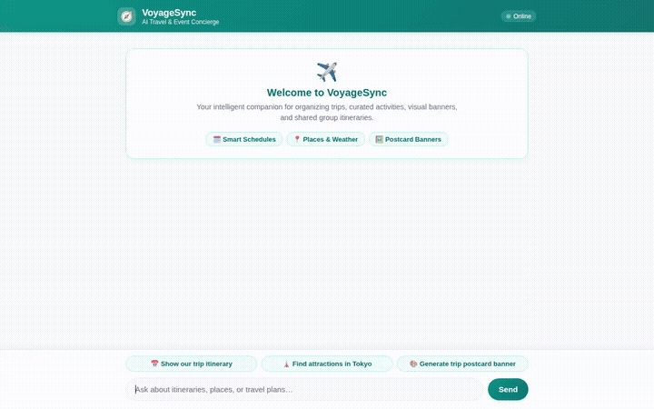

# 🧭 VoyageSync — AI Event & Travel Concierge

A personalized travel and group event concierge built with the **Google Agent Development Kit (ADK)** and **Gemini 3.6 Flash**. VoyageSync helps travelers and groups organize, explore, and share multi-day itineraries, check live local weather and attractions, calculate shared budgets, and generate visual postcard banners.

<p align="center">
  
</p>

---

## 🌟 What VoyageSync Does

VoyageSync connects reasoning capabilities with Google Cloud services to manage travel logistics across conversations:

- **Group Itinerary Management:** Stores, queries, and updates multi-day trip activities with dates, locations, costs, and notes backed by Cloud Firestore.
- **Cross-Session Long-Term Memory:** Retains travel party preferences, dietary restrictions, past destinations, and budget limits across separate sessions using Vertex AI Memory Bank.
- **Live Destination Exploration & Weather:** Discovers points of interest and landmarks using OpenStreetMap Nominatim and fetches real-time temperature, wind, and sky conditions via Open-Meteo.
- **AI Media Generation & Asset Storage:** Generates custom postcard-style trip banners using Gemini 3.1 Flash Lite Image and uploads them to Google Cloud Storage.
- **Safe Code Execution for Expense Splitting:** Runs a remote Agent Engine Sandbox to perform budget math and cost-per-person calculations.
- **Rich Card UI (A2UI):** Emits structured cards, columns, and rows rendered inline in both the ADK Playground and the custom chat frontend.

---

## ☁️ Google Cloud Services & Architecture

Every capability in VoyageSync maps directly to wired implementations in `voyage-sync/app/agent.py`:

| Service / Capability | Implementation Details | Wired In Code |
| :--- | :--- | :--- |
| **Gemini 3.6 Flash** | Core reasoning and orchestration model | `google.adk.models.Gemini` (`gemini-3.6-flash`) |
| **Vertex AI Memory Bank** | Long-term memory extraction and preloading across sessions | `VertexAiMemoryBankService`, `PreloadMemoryTool`, `generate_memories_callback` |
| **Cloud Firestore** | Structured storage for itinerary activities and schedules | `google.cloud.firestore`, collection `itinerary_items` |
| **Cloud Storage** | Public hosting for generated trip banner artwork | `google.cloud.storage.Client`, bucket storage |
| **Gemini 3.1 Flash Lite Image** | On-demand postcard and banner image synthesis | `google.genai.Client` (`gemini-3.1-flash-lite-image`) |
| **Agent Engine Code Sandbox** | Isolated Python execution environment for budget calculations | `AgentEngineSandboxCodeExecutor` |
| **A2UI (v0.8 Basic Catalog)** | Dynamic UI component generation (Card, Column, Row, Text, Image) | `A2uiSchemaManager`, `BasicCatalog`, `a2ui_callback` |
| **FastAPI + A2A Web Frontend** | Branded chat UI communicating over the Agent-to-Agent protocol | `frontend/main.py`, `frontend/static/index.html` |

---

## 🛠️ Implemented Agent Tools

The agent is equipped with the following functions registered in `root_agent.tools`:

1. `PreloadMemoryTool()`: Automatically loads relevant long-term memories and user facts into context at the beginning of each turn.
2. `list_itinerary_items(category, day)`: Queries the Firestore database for scheduled events, with optional filters for category (e.g. *Sightseeing*, *Dining*, *Culture*, *Adventure*) or day (e.g. *Day 1*, *Day 2*).
3. `add_itinerary_item(title, category, day, time, location, cost_per_person, description, notes)`: Creates and persists a new activity with unique identifier into Firestore.
4. `get_itinerary_item(item_id)`: Retrieves full record details for a specific itinerary item.
5. `search_places_and_attractions(query, limit)`: Queries the OpenStreetMap Nominatim API to find real-world landmarks, coordinates, and venues.
6. `get_weather(location)`: Fetches current temperature, humidity, wind speed, and sky conditions using the Open-Meteo forecast API.
7. `get_current_time(query)`: Calculates the local current time and timezone for requested destinations.
8. `generate_trip_image(prompt)`: Synthesizes high-resolution postcard banners via `gemini-3.1-flash-lite-image`, registers the artifact in the ADK session, uploads to Cloud Storage, and returns a public URL.

### 📋 Feature Status & Scope

- **Implemented:** Firestore itinerary CRUD, Memory Bank persistence, live weather, places lookup, code sandbox execution, image generation + Cloud Storage upload, A2UI cards, and FastAPI A2A chat proxy.
- **Planned, Not Yet Implemented:** Automated calendar export (.ics / Google Calendar synchronization), multi-user collaborative voting on activities, and export of Cloud Trace telemetry.

---

## 🚀 Local Setup & Run Guide

### Prerequisites

- Python 3.11+
- [uv](https://docs.astral.sh/uv/) (Python package manager)
- [Google Cloud SDK (`gcloud`)](https://cloud.google.com/sdk/docs/install)
- An active Google Cloud project with Vertex AI and Firestore enabled

### 1. Authenticate with Google Cloud

```bash
gcloud auth login
gcloud auth application-default login
gcloud config set project <YOUR_PROJECT_ID>
```

### 2. Configure Environment Variables

Navigate to the agent directory and set up your `.env` file:

```bash
cd voyage-sync
cp .env.example .env
```

Ensure your `.env` contains:

```bash
PROJECT_ID=<YOUR_PROJECT_ID>
LOCATION=us-east1
GCS_BUCKET_NAME=<YOUR_STORAGE_BUCKET>
MEMORY_BANK_ID=<YOUR_MEMORY_BANK_ID>
AGENT_ENGINE_SANDBOX_RESOURCE_NAME=<YOUR_SANDBOX_RESOURCE_NAME>
```

### 3. Install Dependencies

```bash
# In voyage-sync/
uv sync
```

### 4. Seed the Itinerary Database (Optional)

To populate Firestore with initial sample activities:

```bash
uv run python scripts/seed_firestore.py
```

### 5. Run the Local Development Environment

You can interact with VoyageSync through either the ADK development playground or the custom frontend.

#### Option A: ADK Playground (`adk web`)

```bash
uv run adk web . --port 8000 --reload_agents --memory_service_uri=agentengine://<YOUR_MEMORY_BANK_ID>
```

#### Option B: Custom Web Chat UI

1. Set up the frontend dependencies:
   ```bash
   cd frontend
   python -m venv .venv
   source .venv/bin/activate
   pip install -r requirements.txt
   ```

2. Start the local FastAPI proxy:
   ```bash
   export AGENT_ENGINE_RESOURCE_NAME="projects/<PROJECT_NUMBER>/locations/us-east1/reasoningEngines/<REASONING_ENGINE_ID>"
   export AGENT_DIRECTORY="app"
   export PORT=8080
   python main.py
   ```

3. Open a browser to start planning trips.

---

## 📂 Repository Structure

```
.
├── demo.gif                      # Looping demonstration recording
├── voyage_sync_demo.webm         # Source WebM recording
├── project_brief.md              # Original design brief and tool coverage
└── voyage-sync/
    ├── agents-cli-manifest.yaml  # Agent deployment configuration
    ├── pyproject.toml            # Dependencies and project metadata
    ├── app/
    │   ├── __init__.py
    │   ├── agent.py              # Core Agent, tools, Memory Bank, and A2UI wiring
    │   └── a2ui_utils.py         # Callback formatting A2UI parts for A2A
    ├── frontend/
    │   ├── main.py               # FastAPI proxy talking A2A protocol
    │   ├── requirements.txt      # Frontend server dependencies
    │   └── static/
    │       └── index.html        # Dialogue chat UI with A2UI renderer
    └── scripts/
        └── seed_firestore.py     # Firestore database seeder
```

---

## 📄 License

This project was built for the Build with Gemini World Tour and is licensed under the Apache License 2.0.
